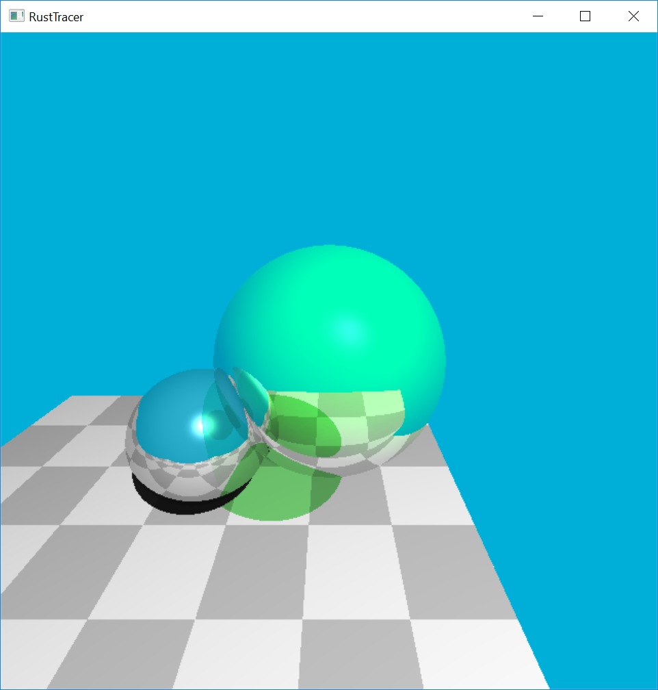

Rust Ray Tracer
===============

Originally built in C++, this ray tracer is a from-scratch reimplementation
of one of my college computer science projects. The early stages of this
particular ray tracer match the incremental stages from the class, but later
commits have fixed problems and added features beyond what I'd previously
built.

What can it do?
---------------
Finished:
- Basic scene rendering
- Shadows
- Phong shading
- Reflection
- Light transmission through transparent objects
- Shadow transmission through semitransparent objects
- Color mixing in transmitted shadows
- Multithreaded rendering

Needs work:
- Coloring semitransparent objects - currently just uses phong illumination

Intended future features:
- Directional lights
- Better parallel rendering, possibly using shaders

Why Rust?
---------
[Rust][rust-lang] is a fast and safe systems programming language that
intends to make critical software more reliable and secure by using language
itself to prevent many common programming errors.

[rust-lang]: https://www.rust-lang.org

Learning Rust has been a fascinating way to expose myself to new technologies
and paradigms that aren't possible to learn while working on production
operating system code. Building a familiar project in a new language is always a
great learning technique, and has helped illustrate the convenient modern
parts of the language (like type inference and iterators) and the challenging
new tools like borrow checking, lifetimes, and compile-time concurrency
guarantees.
